# Citi Bike Data Pipeline - Batch and Streaming Processing

An end-to-end data engineering project that builds a unified analytics platform
for Citi Bike by combining historical trip data and streaming station status data.

The platform combines historical trip data with continuously ingested station
status snapshots to support trip, rider, station, and availability analysis. The
trip and station-status pipelines ingest their respective sources independently
and converge in BigQuery during batch warehouse transformation.

---

## Architecture

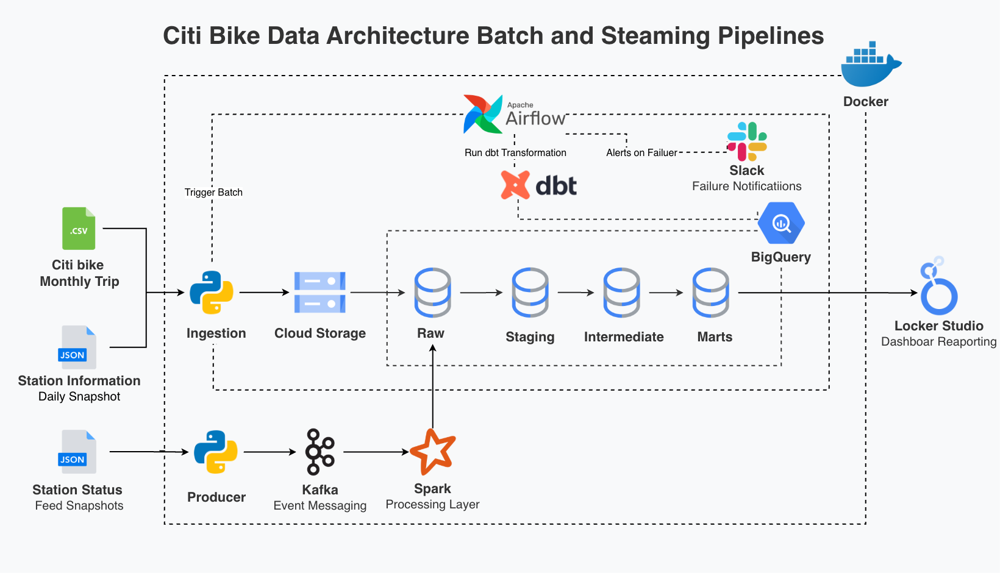

---

## Data Source Information

| Category | Parameter | Details |
|---|---|---|
| **Batch Data** | Dataset | Citi Bike Trip History |
| | Trip Data | January – August 2026 |
| | Source Format | ZIP/CSV trip records |
| **Batch Data** | Dataset | Citi Bike Station Information |
| | Processing Period | Daily snapshots |
| | Source Format | JSON |
| **Streaming Data** | Data Type | Station status snapshots |
| | Source | Citi Bike GBFS station status feed |
| | Message Format | JSON |

---

## Technology Stack

| Category | Technology |
|---|---|
| Programming Language | Python |
| Data Orchestration | Apache Airflow 3.1.7 |
| Data Transformation | dbt |
| Data Warehouse | Google BigQuery |
| Cloud Storage | Google Cloud Storage |
| Message Broker | Kafka |
| Streaming Processing | PySpark |
| Containerization | Docker & Docker Compose |

---

## Analytics Use Cases

The analytical platform supports the following analyses:

1. Analyze how trip demand changes over time and how usage differs between member and casual riders.
2. Identify stations with the highest trip activity and utilization.
3. Analyze demand by day and hour to identify peak usage periods.
4. Monitor changes in bike and dock availability across stations over time.
5. Identify stations that most frequently experience empty or full conditions.
6. Analyze the relationship between station trip activity and bike/dock availability by station and day.

---

## Data Model

The data warehouse separates raw ingestion, source standardization, data quality processing, and analytical modeling. dbt dependencies are managed with model references, while Airflow orchestrates the high-level transformation layers.

| Layer | Models | Purpose |
|---|---|---|
| **Raw** | `raw_trip_history`, `raw_station_information`, `raw_station_status` | Stores ingested trip history, station information snapshots, and station status snapshots. |
| **Staging** | `stg_trip_history`, `stg_station_information`, `stg_station_status` | Standardizes source fields and data types before downstream transformations. |
| **Intermediate** | `int_trip_history`, `int_station_identity`, `int_station_status`, `int_quarantine_trip`, `int_quarantine_station_status` | Applies validation, deduplication, station identity handling, and quarantine logic before the analytical layer. |
| **Marts** | `dim_date`, `dim_station`, `fct_trip`, `fct_station_status`, `agg_daily_trip_summary`, `agg_station_activity`, `agg_station_daily` | Provides dimensional, fact, and aggregated datasets for analytical use. |

---

## Dimensional Modeling

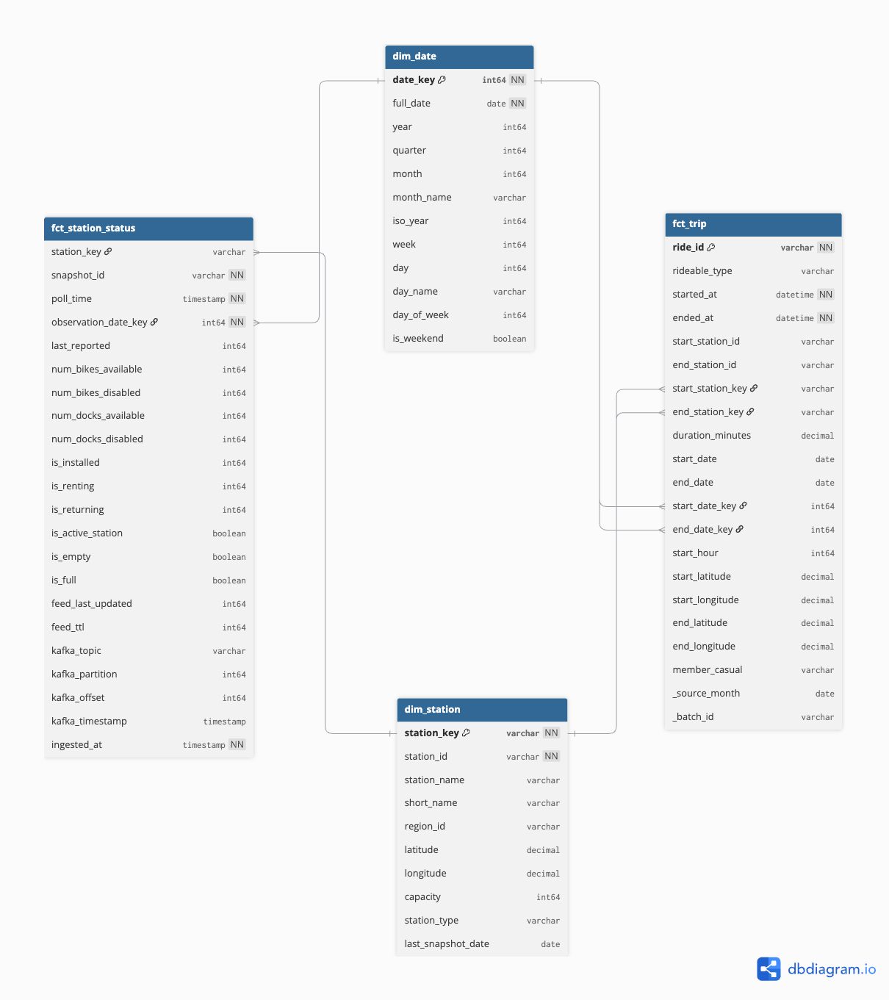

The analytical warehouse is built around two business processes: trip activity and station status monitoring.

- **`fct_trip`** — Grain: one row per valid trip. Used to analyze trip demand, rider behavior, routes, and station activity.
- **`fct_station_status`** — Grain: one row per station for each polling snapshot. Used to analyze bike availability, dock availability, and station conditions.

### Conformed Dimensions

Both fact tables use shared dimensions:

- **`dim_date`** — Provides a consistent calendar reference for date-based analysis. In `fct_trip`, it is used for both trip start and end dates, while `fct_station_status` uses it for the observation date.
- **`dim_station`** — Provides the canonical station reference used across trip and station-status data. In `fct_trip`, it is used for both start and end stations.

`dim_station` follows a current-state SCD Type 1 approach. The latest station snapshot is kept for each station, so historical station versions are not preserved.

Together, the two fact tables and their shared dimensions form a fact constellation. Each fact table keeps its own grain and is modeled independently rather than joining facts with different grains directly.

---

## Data Quality & Reliability

- **Validation** — Invalid trip and station-status records are identified and separated into `int_quarantine_trip` and `int_quarantine_station_status` before reaching the analytical facts.
- **Deduplication** — Duplicate Kafka records are identified using the Kafka topic, partition, and offset, while duplicate station observations are deduplicated by station and polling snapshot before downstream aggregation.
- **Idempotency** — Batch ingestion and warehouse loading are designed to be safely rerun. Existing GCS batch data is replaced and affected BigQuery partitions are overwritten instead of appending duplicate records.
- **Incremental processing** — Trip models incrementally refresh the latest landed source batch, while station-status models use BigQuery partition boundaries to process newly arrived partitions. The combined `agg_station_daily` model is rebuilt as a table because it combines trip and station-status data with different arrival patterns.
- **Kafka Dead Letter Queue** — Invalid feed responses and station records are routed to a dedicated Kafka DLQ topic so invalid data can be isolated without stopping the main ingestion flow.

---

## Observability

- **Task execution logging** — Each task attempt is recorded in `citibike_ops.batch_run_log`, including the DAG run, batch, task, attempt number, execution time, status, and error message.
- **Airflow callbacks** — Success, retry, and failure callbacks capture task execution events. Retry and failed attempts are recorded as `FAILED`, while `try_number` shows the attempt number.
- **Slack alerts** — A final task failure sends a Slack notification with the batch, task, DAG run, and error details.

---

## Key Design Decisions

- **Separate ingestion and transformation responsibilities** — The `citibike_trip_ingestion` DAG runs monthly and loads trip history into the Raw layer. The streaming service continuously ingests station-status snapshots into `raw_station_status`. A separate `citibike_batch_transform` DAG runs daily to refresh station information and build the analytical warehouse.

- **Streaming stops at Raw** — Kafka and Spark are responsible for continuous station-status ingestion and processing only. The streaming pipeline stops after writing `raw_station_status`; downstream warehouse modeling is handled in the daily dbt transformation.

- **Daily station information refresh** — `station_information` is refreshed once per day because it represents current station metadata rather than a continuous historical stream. The snapshot is loaded into Raw and used to maintain the current-state `dim_station`.

- **Layered dbt orchestration** — Airflow runs dbt in three high-level layers: staging, intermediate, and mart. Each layer is a separate Airflow task, so a failed layer can be retried without rerunning previously completed layers. dbt still manages model dependencies within each layer.

- **Latest landed trip batch drives incremental trip models** — The daily transformation DAG reads the latest `source_month` available in `raw_trip_history` and passes it to dbt. This keeps trip processing aligned with the latest landed monthly batch without making the daily DAG depend on a fixed calendar month.

---

## Known Limitations & Assumptions

- **Dashboard coverage** — The current dashboard covers the main analytical questions but does not represent all possible business use cases.

- **Streaming scale** — The GBFS station-status feed is a periodic snapshot source. Spark Structured Streaming provides continuous ingestion, although the current workload does not require large-scale distributed processing.

- **Current station information** — The Citi Bike `station_information` GBFS feed provides current station information rather than historical snapshots. Historical station information cannot be backfilled for a specific past month from this source, so `dim_station` uses the latest available station snapshot and does not preserve historical station attribute changes.

- **Source coverage periods** — The current landed trip data contains source batches from February through July 2026, with trip records dated January 30 through July 31, 2026. Station-status observations currently begin in September 2026. Therefore, the current data does not contain an overlapping observation period for proving a same-period relationship between trip activity and station availability. The analytical layer can combine the sources at station-day grain when their dates overlap, but the current dataset should not be presented as evidence of such an overlap.

- **Source month vs. trip date** — `source_month` identifies the monthly ingestion batch, while `started_at` represents the actual trip timestamp. A monthly source batch can contain trips from adjacent calendar dates, as shown by July batch data containing trips from June 30.

- **Python test coverage** — Unit tests with `pytest` and test coverage were not implemented to validate the Python orchestration and pipeline components.

---

## Proof of Execution

### Batch Orchestration

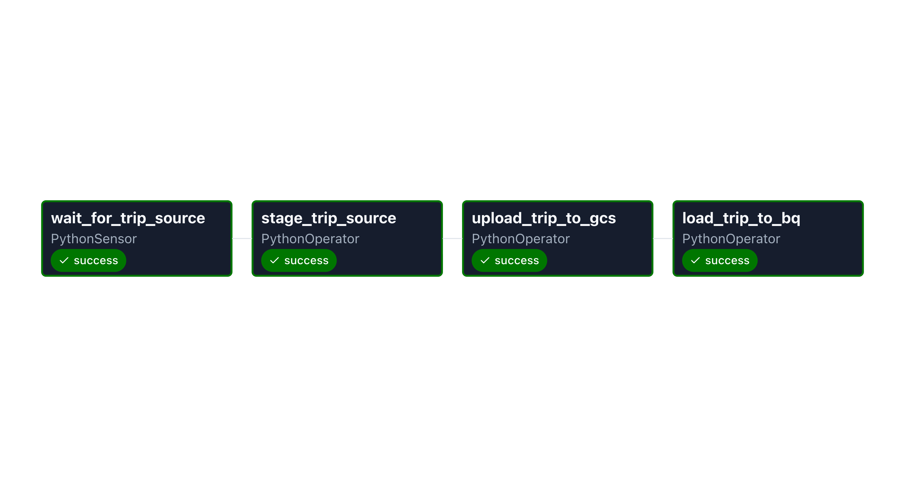

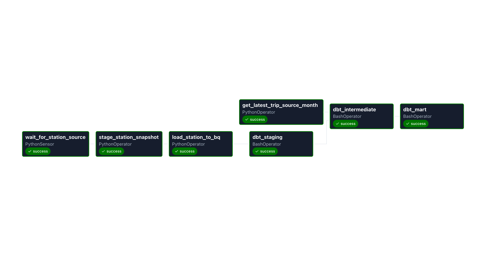

The trip ingestion and daily batch transformation DAGs completed successfully.

### Producer

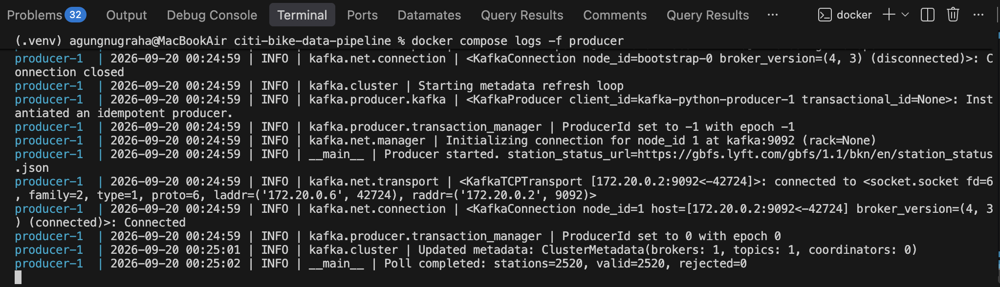

Station status snapshots published to Kafka.

### Consumer

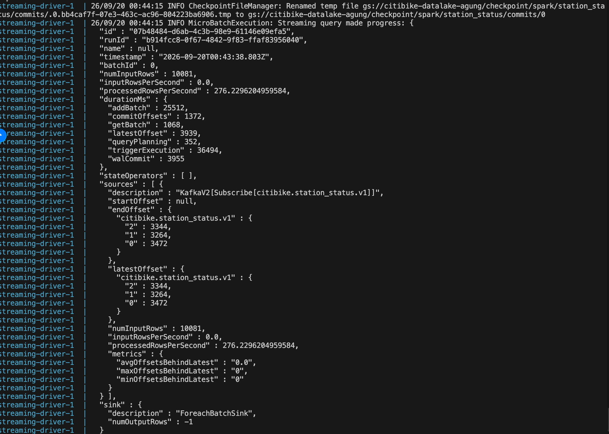

Station status snapshots processed with Spark Structured Streaming.

### dbt Documentation

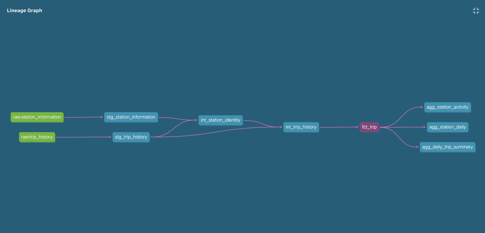

dbt model lineage showing the transformation flow.

### Batch Output

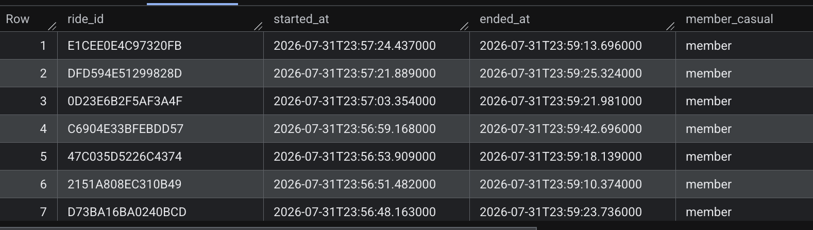

Batch trip records written to BigQuery `fct_trip`.

### Streaming Raw Output

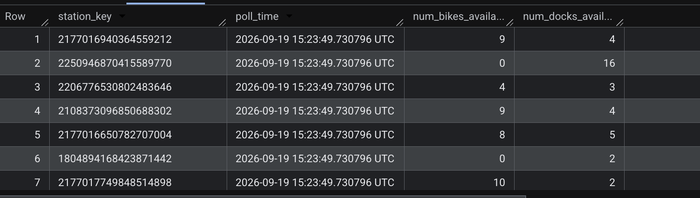

Station status snapshots written to the BigQuery Raw layer as `raw_station_status`. The analytical `fct_station_status` is built later by the daily dbt transformation.

### Source Output Comparison

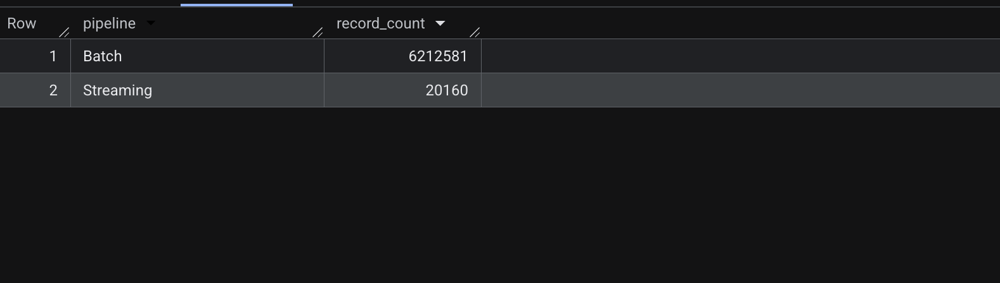

Record count comparison between batch and streaming outputs.

### Slack Notifications

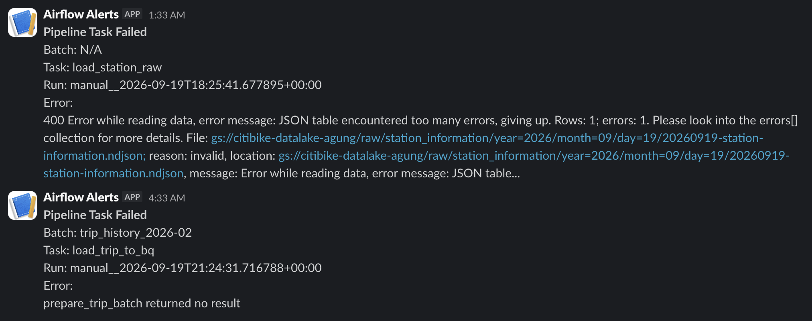

Slack notification showing a pipeline task failure.

### Dashboard

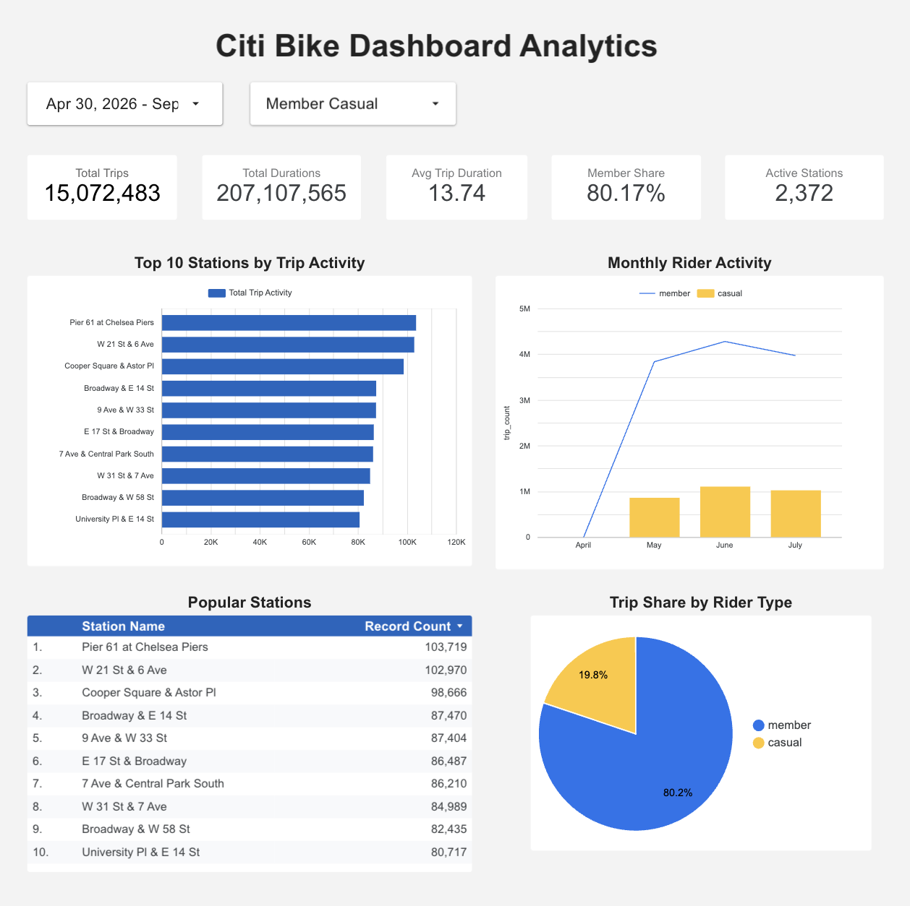

---

## For Future Development

- **Dashboard improvements** — Improve the dashboard design and expand its analytical coverage.

- **Python test coverage** — Add unit tests with `pytest` and implement test coverage for the Python pipeline components.

- **CI/CD pipeline** — Add a CI/CD pipeline to automate testing and deployment.

- **Project documentation** — Improve the documentation for the project and its codebase.

---

## Setup & Configuration

- Docker & Docker Compose
- Python 3.13 and a virtual environment (`.venv`)
- `gcloud` CLI, authenticated to your own GCP project
- A GCP service account with access to BigQuery and GCS

### Steps

1. **Clone the repository**

```bash
git clone https://github.com/agungngrh/citi-bike-data-pipeline.git
cd citi-bike-data-pipeline
```

2. **Set up your environment file**

```bash
cp .env.example .env
```

Fill in `.env` with your own values, including your GCP project ID, region, bucket name, BigQuery dataset names, Kafka topics, and Spark configuration.

Configuration is loaded and validated through `config/settings.py`. Missing required variables will raise a clear error at startup instead of causing the pipeline to fail silently later.

3. **Install Python dependencies**

```bash
python3 -m venv .venv
source .venv/bin/activate        # macOS/Linux
.venv\Scripts\activate          # Windows

pip install -r requirements.txt
```

4. **Authenticate to your GCP account**

```bash
gcloud auth login
gcloud config set project <your-gcp-project-id>
gcloud auth application-default login
```

5. **Build Docker Images**

```bash
docker compose build
```

---

## Running the Batch Pipeline

The batch pipeline is orchestrated by two Airflow DAGs: `citibike_trip_ingestion` for monthly trip ingestion and `citibike_batch_transform` for the daily station refresh and dbt warehouse transformation.

```bash
docker compose up -d airflow-init airflow-worker airflow-apiserver airflow-dag-processor airflow-scheduler
```

After starting Airflow, open `http://localhost:8080` and unpause the DAG.

---

## Running the Streaming Pipeline

```bash
docker compose up -d producer
docker compose up -d streaming-driver
```

---

## Project Structure

```text
citi-bike-data-pipeline/
├── airflow/              # Airflow DAGs and orchestration
│   └── dags/
├── config/               # Project configuration and settings
├── dbt/                  # Data transformation and data modeling
│   ├── models/
│   └── tests/
├── docker/               # Dockerfiles and environment configurations
├── scripts/              # Project setup and utility scripts
├── spark/                # Spark streaming jobs
├── sql/                  # BigQuery datasets, raw tables, and operational SQL
├── src/                  # Core pipeline application code
│   ├── batch/
│   ├── streaming/
│   └── observability/
├── docker-compose.yaml   # Local multi-service orchestration
├── requirements.txt      # Python dependencies
└── README.md             # Project documentation
```
